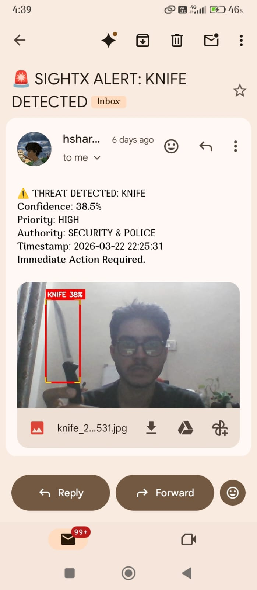

# **SightX: Proactive AI Surveillance Platform**

---

## 📌 Overview
SightX is an AI‑powered surveillance system designed to detect violent activity in real time.  
It integrates advanced deep learning models (**YOLO, ResNet50V2, Bi‑LSTM**) with a minimal desktop application interface to provide alerts, logs, and system monitoring.  
The focus is on backend intelligence, with a streamlined frontend that supports functionality without overshadowing the detection engine.

---

## 📂 Project Structure
- **`src/`** → Source code (frontend + backend integration).  
- **`assets/`** → Logos, images, demo videos.  
- **`docs/`** → Documentation, design notes, and references.  
- **`README.md`** → Project overview and usage instructions.  

---

## ⚙️ Features
- Real‑time video feed with detection overlays.  
- Violence classification with confidence scores.  
- System stats monitoring (RAM, CPU, GPU, FPS).  
- Incident logging into SQLite with timestamps.  
- Red banner + voice alerts for detected threats.  
- Demo mode for controlled demonstrations.  

---

## 🛠 Tech Stack
### Core Libraries
- **Python Standard Library**: `sys`, `os`, `datetime`, `threading`, `time`  
- **Computer Vision**: `opencv-python (cv2)`, `numpy`  
- **Database**: `sqlite3`  
- **System Monitoring**: `psutil`  
- **Voice Alerts**: `pyttsx3`  

### Models & Frameworks
- **YOLO** (object detection)  
- **ResNet50V2** (feature extraction)  
- **Bi‑LSTM** (temporal classification)  

---

## 🚀 Getting Started
### Prerequisites
- Python 3.10+  
- Dependencies listed in `requirements.txt`  

---

## 📦 How to Use (Deployed App)
1. Download the **ZIP file** containing the executable from the provided Google Drive link.  
2. Extract the contents of the ZIP file to a folder on your system.  
3. Locate the `SightX.exe` file inside the extracted folder.  
4. Double‑click `SightX.exe` to launch the application.  
5. The desktop interface will open, allowing you to:  
   - Start/stop real‑time surveillance.  
   - View detection overlays and system stats.  
   - Receive alerts and review incident logs.  
6. For demo purposes, switch to **Demo Mode** within the app to simulate detection events.  

---

## 📂 App ZIP File Link
📥 [Download App](https://drive.google.com/file/d/1Q38cCR6Du2H9lOr4tFUhCblvo2FHx2fA/view?usp=drive_link)

---

## 👥 Contributors
- **Harshit Sharma** – Project Lead & Frontend Development  
- **Yash Raj** – Backend Developer with ML Model Specialization  

---

## 🔗 Profiles
- **Harshit Sharma**  
  [LinkedIn](https://www.linkedin.com/in/harshit-sharma-4a167237b/)  
- **Yash Raj**  
  [LinkedIn](https://www.linkedin.com/in/yash-raj-299802383/)  

---

## 📌 Notes
- This repository only contains the **deployed application** of *PROJECT SightX*.  
- The original source codes are maintained privately in a separate repository to avoid plagiarism.  
- Access to that repository is strictly controlled. Recruiters or collaborators may request access as per requirements.  
- Any error in execution may be due to **user misinterpretation** and should not be declared as a development error.  
- Users may contact the developers in such cases.  
- This project is still under **active development**, with improvements in progress to deliver a user‑friendly product.  

---

## 📷 Project Visuals

  
  

  

