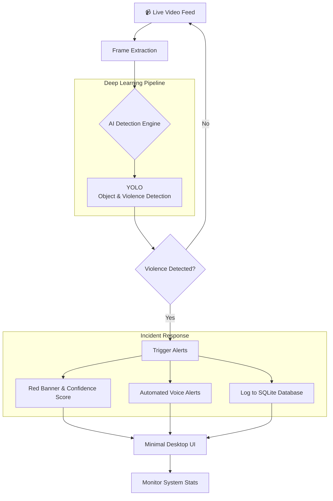

<div align="center">

# 👁️‍🗨️ SightX: Proactive Automated Surveillance Platform

**Empowering security with real-time, ML-driven threat detection.**

<p align="center">
  
  
  
  
</p>

</div>

---

## Overview

**SightX** is an advanced AI‑powered surveillance system engineered to detect violent activity in real-time. 

By integrating a state-of-the-art deep learning model—**YOLO**—with a streamlined, minimal desktop application, SightX delivers a proactive approach to security. The platform prioritizes backend intelligence, ensuring robust threat detection while providing critical alerts, incident logging, and system monitoring through an unobtrusive frontend interface.

---

## System Workflow

Here is a high-level representation of how the SightX detection engine processes real-time surveillance:



---

## Key Features

- **Real‑Time Video Feed:** Live monitoring with dynamic bounding box detection overlays.
- **Violence Classification:** Highly accurate threat detection with live confidence scores.
- **System Stat Monitoring:** Keep track of hardware performance (RAM, CPU, GPU, FPS).
- **Automated Incident Logging:** Securely stores timestamped threat events into a local SQLite database.
- **Instant Threat Alerts:** Triggers visual red banners and automated voice alerts upon threat detection.
- **Demo Mode:** Built-in controlled environment for easy demonstrations and testing.

---

## Real-World Impact

SightX is designed to save lives and reduce response times across various critical sectors:

- **Bank Security:** Proactively detects gunpoint robberies. Integrates with existing CCTV systems to automatically alert law enforcement without requiring human intervention.
- **School Safety:** Monitors campuses for weapons or violent altercations, ensuring immediate alerts to authorities to help prevent tragedies.
- **Public Spaces:** Enhances public safety in crowded areas like malls and transit stations through automated, real-time threat reporting.

---

## **Achievements & Recognition**

- **SightX** has been represented at the **HACKINDIA SPARK 4 2026 HACKATHON** – *KCC Institute of Technology & Management, Greater Noida, U.P., India*

---

## Tech Stack

### Core Technologies
*   **Language:** Python 3.10+
*   **Standard Libraries:** `sys`, `os`, `datetime`, `threading`, `time`
*   **Computer Vision:** `opencv-python` (cv2), `numpy`
*   **System & Utilities:** `psutil` (Hardware monitoring), `pyttsx3` (Voice alerts)
*   **Database:** `sqlite3`

### Machine Learning Frameworks
*   **YOLO:** High-speed object and violence detection.

---

## Project Structure

```text
SightX/
├── src/          # Source code (frontend + backend integration)
├── assets/       # Logos, icons, and demo videos
├── docs/         # Documentation, design notes, and references
└── README.md     # Project overview and usage instructions
```

---

## Getting Started

**Quick Launch:** No setup required! Just run the deployed executable.

1. **[Download SightX App](https://drive.google.com/file/d/1Q38cCR6Du2H9lOr4tFUhCblvo2FHx2fA/view?usp=drive_link)** (ZIP File)
2. **Extract** the folder and locate `SightX.exe`.
3. **Double-click** to launch the dashboard.
4. Use **Demo Mode** to instantly test the threat detection.

---

## Project Visuals

<p align="center">
  
  
</p>

<p align="center">
  
</p>

---

## Contributors

| Name | Role | Connect |
| :--- | :--- | :--- |
| **Harshit Sharma** | Project Lead & Frontend | [](https://www.linkedin.com/in/harshit-sharma-4a167237b/) |
| **Yash Raj** | Backend Developer & ML | [](https://www.linkedin.com/in/yash-raj-299802383/) |

---

<br>

> **⚠️ Disclaimer:** This repository hosts the deployed application for demo purposes. Please note that any errors occurring due to incorrect user implementation or environmental misconfigurations must not be inferred as a development error.

<div align="center">
  <i>Built to make the world a safer place.</i>
</div>


